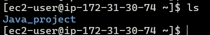
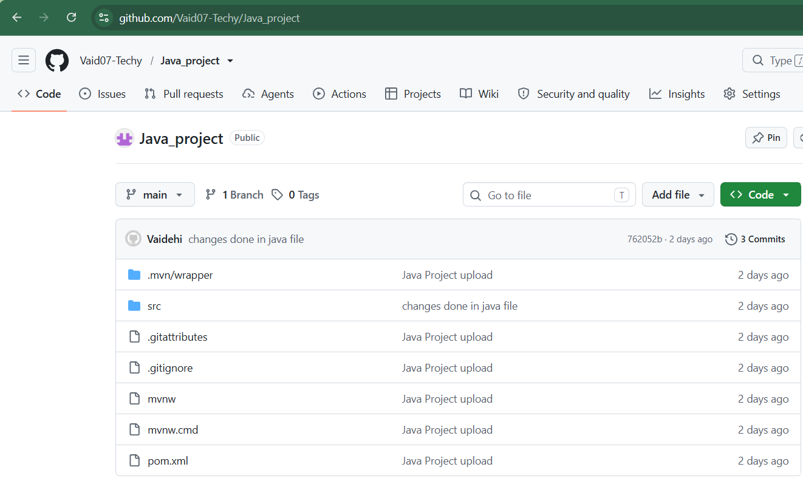
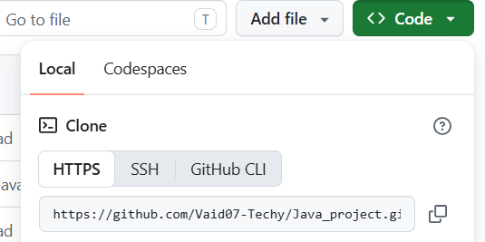
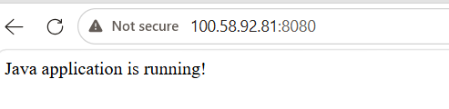
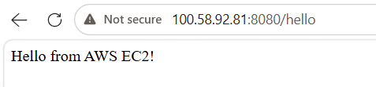

# AWS Java Spring Boot Application

A simple Java Spring Boot web application deployed on an AWS EC2 instance.

This project demonstrates the basic workflow of developing a Java application, pushing it to GitHub, cloning it on an AWS EC2 server, building it using Maven, and running the generated JAR file.

## 🚀 Project Overview

The application is built using:

- Java 25
- Spring Boot 4.1.1
- Maven
- Git & GitHub
- AWS EC2
- Amazon Linux 2023

The application provides simple REST endpoints to verify that the Spring Boot application is running successfully.

## 🏗️ Architecture

```text
Developer Machine
       |
       | git push
       ↓
     GitHub
       |
       | git clone
       ↓
   AWS EC2 Instance
       |
       | mvn clean package
       ↓
   Executable JAR
       |
       | java -jar
       ↓
Spring Boot Application
       |
       | Port 8080
       ↓
    Web Browser

```


## Project Structure

```
aws-java-app/
│
├── src/
│   ├── main/
│   │   └── java/
│   │       └── com/
│   │           └── example/
│   │               └── aws_java_app/
│   │                   ├── AwsJavaAppApplication.java
│   │                   └── HelloController.java
│   │
│   └── test/
│
├── target/                         ← Created by Maven during build
│   └── aws-java-app-0.0.1-SNAPSHOT.jar
│
├── pom.xml
├── README.md
└── .gitignore

```
<b>Note : </b>

The "target" folder is automatically created by Maven when mvn package or mvn clean package is executed. It contains compiled classes and the generated JAR file.

## Technologies used 


| Technologies | Purpose | 
| :--- | :---: 
| Java | Application development | 
| Spring Boot | Web application framework | 
| Maven | Build and dependency management |
| Git | Version control |
| GitHub | Source code repository |
| AWS EC2 | Application hosting |
| Amazon Linux | EC2 operating system |

## Application Endpoints

<H3>Home</H3>

```
GET /

```

<H3>Hello</H3>

```
GET /hello
```


<H3>Response</H3>

```
Hello From EC2
```

## Prerequisites

Before running the project, make sure the following are installed:

- Java 25
- Maven
- Git

For AWS deployment:

- Amazon Linux OS
- EC2 instance
- Security Group allowing TCP port 8080
- SSH access to the EC2 instance

## Application Code
<b>Main Application : </b>

The Spring Boot application starts from:
```
AwsJavaAppApplication.java
```

This class contains the main method used to start the Spring Boot application.

<b>REST Controller : </b>

The application uses:
```
HelloController.java
```

<b>The controller provides two endpoints.</b>

<h4>1. Home Endpoint</h4>

```
GET /
```

Response:
```
Java application is running!
```

<h4>Hello Endpoint</h4>

```
GET /hello
```

Response:
```
Hello from AWS EC2!
```

## Deploying to AWS EC2

<h3>1. Launch EC2 Instance :</h3>

launch and connect to EC2 Instance using SSH 
```
ssh -i <key-file>.pem ec2-user@<EC2-PUBLIC-IP>
```
<h3>2. Install Java :</h3>

install using 
```
sudo yum install java-25-amazon-corretto-devel -y
```
verify 
```
java --version
```

<h3>3. Install Maven :</h3>

install using
```
sudo yum install maven -y
```
verify 

```
mvn --version
```

<h3>4. Clone The Repository :</h3>

```
git clone <YOUR-GITHUB-REPOSITORY-URL>
```
navigate Into the project Folder :

After cloning you will see your project folder in instance, enter in that folder

for eg :

```
cd <your project folder name>
```

Note :- make sure you have created your project repo on GitHub where you have uploaded your working project

my Repo :


repo url :


Note : use this url while cloning the project in EC2 instance

<h3>5. Configure JAVA_HOME :</h3>

```
export JAVA_HOME=/usr/lib/jvm/java-25-amazon-corretto.x86_64
```
verify 

```
echo $JAVA_HOME
```
check the maven's version 

```
mvn --version
```

<h3>6. Build The Application :</h3>

Run:

```
mvn clean package
```
<b>Note :</b>

The "clean" phase removes files from the previous build.

The "package" phase builds the application and creates a distributable package.

If the build is successful, Maven generates:

```
target/aws-java-app-0.0.1-SNAPSHOT.jar
```

<h3>7. Run The Application :</h3>

```
java -jar target/aws-java-app-0.0.1-SNAPSHOT.jar
```
The Spring Boot application starts on:

```
Port 8080
```
## Security Group Configuration 

Note:- allow port 8080 in security group configuration of Instance

```
Type: Custom TCP
Port: 8080
Source: Your IP address
```
For temporary testing, you can set source: Anywhere IP(0.0.0.0/0)

## Access the Application from the Internet

Once the Spring Boot application is running and port 8080 is allowed in the Security Group, access it using:

```
http://<EC2-PUBLIC-IP>:8080/
```

The application should return:
```
Java application is running!
```

Test:
```
http://<EC2-PUBLIC-IP>:8080/hello
```

Expected response:

```
Hello from AWS EC2!
```

## Output

Endpoint : /


Endpoint : /hello



## Important Concetpts :

<h3>1. Why did we configure JAVA_HOME?</h3>

JAVA_HOME is an environment variable that tells applications where the Java Development Kit (JDK) is installed.

In our EC2 server, Java 25 was installed at:
```
/usr/lib/jvm/java-25-amazon-corretto.x86_64
```

So we configured:
```
export JAVA_HOME=/usr/lib/jvm/java-25-amazon-corretto.x86_64
```

<b>Why is this required?</b>

Different tools need to know which Java installation they should use.

<b>Note: </b>

we used java 25 because spring boot project is configured with java 25 version

also This is a temporary environment variable.
It applies only to the current shell/session.

<h3>2. What is Maven?</h3>

Maven is a build and project management tool for Java applications.

It helps us:
```
Download dependencies
Compile Java code
Run tests
Package the application
Create the JAR file
Manage the project build
```

Maven gets most of its project configuration from:
```
pom.xml
```

Our project has:

pom.xml

which contains information such as:
```
Spring Boot version
Java version
Dependencies
Project information
Maven plugins
```
Maven sees this dependency and downloads the required libraries.

<h3>3. What are the endpoints?</h3>

An endpoint is a URL through which a client can communicate with an application.

Our application has two endpoints.

Endpoint 1:
``` 
/
```

The controller contains:

```

@GetMapping("/")
public String home() {
    return "Java application is running!";
}
```

When we request:
```
GET /
```

the application returns:
```
Java application is running!
```

For example:
```
http://<EC2-PUBLIC-IP>:8080/
```

This endpoint is mainly used to check whether the application is running.

Endpoint 2: 
```
/hello
```

The controller contains:
```
@GetMapping("/hello")
public String hello() {
    return "Hello from AWS EC2!";
}
```

When we request:
```
GET /hello
```

the application returns:
```
Hello from AWS EC2!
```

For example:
```
http://<EC2-PUBLIC-IP>:8080/hello
```

This demonstrates how a Spring Boot application can expose different URLs for different functionality.


Author

Vaidehi Gawde

BSc Computer Science | Cloud Computing Learner

